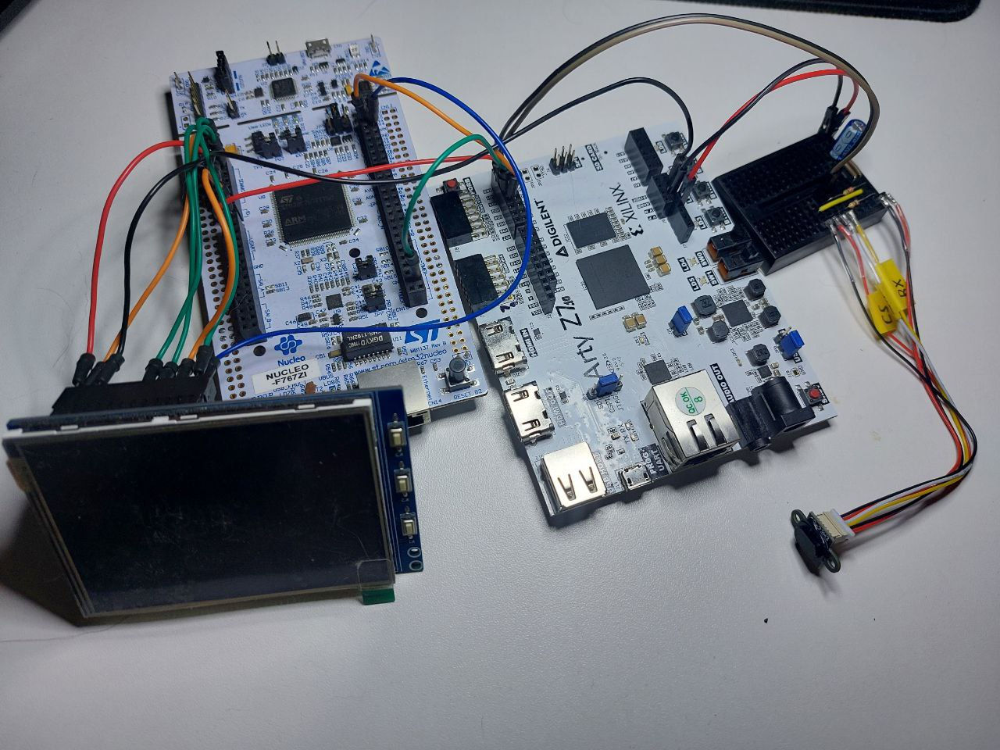
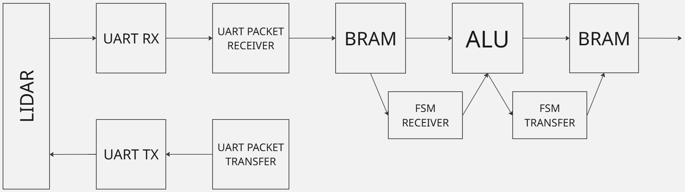
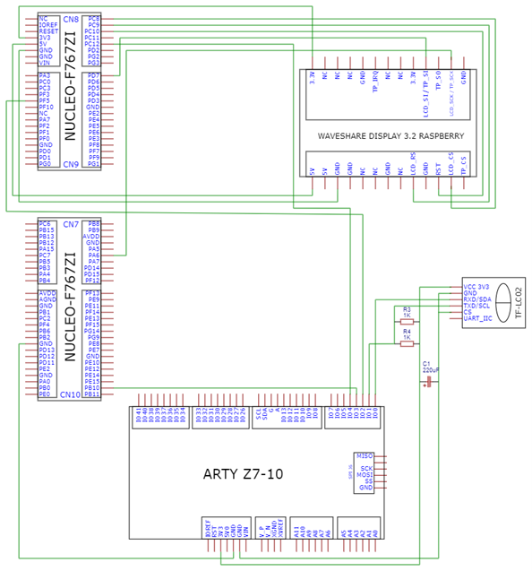

# Computer-Integrated Optoelectronic System for Autonomous Vehicle Control

## Overview

This repository contains the implementation of a **hardware–software complex** designed for real-time processing and visualization of sensor data in an autonomous vehicle environment.  
The system combines an **FPGA-based computational core** with an **STM32 microcontroller**, ensuring parallel signal processing and reliable data exchange through SPI and UART interfaces.

The project implements a complete data pipeline:
```
LiDAR → FPGA → MCU → Display
```



---

## System Architecture

The architecture integrates three functional layers:

**1. Sensor & Communication Layer**  
LiDAR sensors transmit distance measurements via UART to the FPGA. The UART receiver module decodes incoming packets and stores data in the BRAM.

**2. Processing Layer (FPGA)**  
The ALU module calculates *distance*, *velocity*, and *acceleration* using three successive readings. Data movement between UART, BRAM, and ALU is managed by dedicated FSMs.  
Processed results are then transferred to the SPI master module for transmission.

**3. Visualization Layer (MCU)**  
The STM32 Nucleo-F767ZI board receives data through SPI, processes it using HAL drivers, and displays results on the TFT screen.

---

  
*Figure 1. Data acquisition and FPGA processing (Layers 1–2). The visualization layer (MCU + display) is implemented separately in the STM32 firmware.*

---

## Hardware Setup

The system consists of two development boards working in synchronization:  

- **FPGA:** Arty Z7 board running the VHDL design  
- **MCU:** STM32 Nucleo-F767ZI board based on ARM Cortex-M7  

Communication interfaces:  
- **UART** — receives sensor data from LiDAR  
- **SPI** — transmits processed values from FPGA to STM32  

  
*Wiring diagram showing interconnection between LiDAR, FPGA, MCU, and display.*

---

## FPGA Design Description

**Language:** VHDL / SystemVerilog  
**Tools:** Xilinx Vivado 2024.2  

Main modules:  
- `core_top.vhd` — top-level integration of all subsystems  
- `alu.vhd` — arithmetic logic unit computing distance, velocity, and acceleration  
- `dma_rx_bram.vhd`, `dma_bram_tx.vhd` — data transfer between UART, BRAM, and ALU  
- `dma_receive_bram_to_alu.vhd`, `dma_transfer_alu_to_bram.vhd` — internal data routing  
- `One_clock_bram.vhd`, `ram_pkg.vhd` — BRAM memory implementation  
- `spi_master.vhd` — communication with STM32 over SPI  
- `uart_packet_receiver.vhd`, `uart_rx.vhd`, `uart_tx.vhd` — UART receiver, transmitter, and packet logic  
- `top_tb.sv` — SystemVerilog testbench with golden model  

FSM-based data flow ensures pipeline execution with deterministic latency.  
Each DMA controller operates under a single-clock domain with independent read/write cycles.

---

## MCU Firmware Description

**Language:** C (STM32 HAL)  
**IDE:** STM32CubeIDE  

Firmware modules:  
- `main.c` — system initialization, peripheral setup, and main loop  
- `spi.c` — configuration of SPI interface and reception of processed data (distance, velocity, acceleration) from FPGA  
- `usart.c` — UART communication for debugging and LiDAR testing  
- `gpio.c`, `tim.c` — GPIO configuration and timer-based visualization refresh control  
- `ILI9341_STM32_Driver.c`, `ILI9341_GFX.c` — display driver and graphics routines for the TFT ILI9341 screen  
- `img_objects.h`, `snow_tiger.h`, `array_TIGER_landscape.h` — embedded images and font resources for graphical output  
- `stm32f7xx_it.c`, `stm32f7xx_hal_msp.c` — interrupt handlers and HAL MSP setup  
- `syscalls.c`, `sysmem.c` — system routines for newlib I/O and memory allocation  
- `system_stm32f7xx.c` — PLL setup, clock tree configuration, and SystemCoreClock management  

---

## Build Instructions

### FPGA Part
To build and synthesize the FPGA design in **Vivado 2024.2**, run:
```bash
vivado -mode batch -source build.tcl
```
This script automatically adds all source files, applies constraints, configures IP cores, and launches synthesis and implementation.

### MCU Part
Open the `.project` file in **STM32CubeIDE** and build the firmware using:
```
Build → Project → LCD_767 → Debug
```
Then flash the firmware to the **STM32 Nucleo-F767ZI** board via **ST-Link**.

---

## Repository Structure

```
├── photos/                     → project photos  
│   ├── full_prj.jpg            → overall system view  
│   └── func_scheme_main.jpg    → functional diagram (Layers 1–2)  
│
├── VHDL part/                  → FPGA design (Vivado 2024.2)  
│   ├── sources/rtl/            → main HDL modules  
│   │   ├── alu.vhd  
│   │   ├── core_top.vhd  
│   │   ├── dma_*.vhd  
│   │   ├── One_clock_bram.vhd  
│   │   ├── ram_pkg.vhd  
│   │   ├── spi_master.vhd  
│   │   ├── uart_*.vhd  
│   │   └── ...  
│   ├── constraints/            → XDC pin assignments (Arty Z7-10)  
│   ├── sim/                    → SystemVerilog testbench (top_tb.sv)  
│   ├── scripts/                → build automation (Tcl)  
│   │   ├── build.tcl  
│   │   ├── settings.tcl  
│   │   └── common/             → helper Tcl scripts  
│   ├── diploma.tcl             → full Vivado build script  
│   └── build/                  → implementation outputs  
│
├── C part/                     → MCU firmware (STM32CubeIDE)  
│   └── display/                → main STM32 project (LCD_767)  
│       ├── Core/  
│       │   ├── Inc/            → headers (GPIO, SPI, TIM, USART, etc.)  
│       │   ├── Src/            → sources (main.c, spi.c, usart.c, ...)  
│       │   │   └── ILI9341/    → TFT display driver and graphics  
│       │   └── Startup/        → MCU startup file  
│       ├── Drivers/  
│       │   ├── CMSIS/          → ARM Cortex-M7 core headers  
│       │   └── STM32F7xx_HAL_Driver/ → STM32 HAL drivers  
│       ├── LCD_767.ioc         → CubeMX configuration  
│       └── .project, .cproject → STM32CubeIDE project files  
│
└── README.md                   → documentation  
```

---

## Reference

This project is based on the bachelor’s thesis:  
**["Комп’ютерно-інтегрована оптико-електронна система для автоматичного керування автомобілем"](https://ela.kpi.ua/handle/123456789/74926)**  
Author: **Nikita Biriuk**  
Language: *Ukrainian*  
Institution: *Igor Sikorsky Kyiv Polytechnic Institute, Department of Computer-Integrated Optical and Navigation Systems, 2025.*

---
